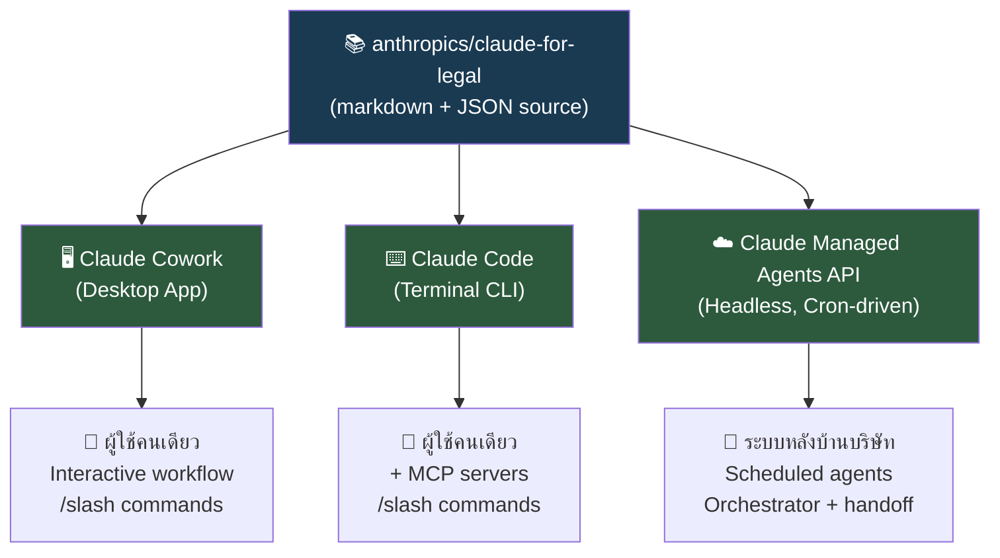
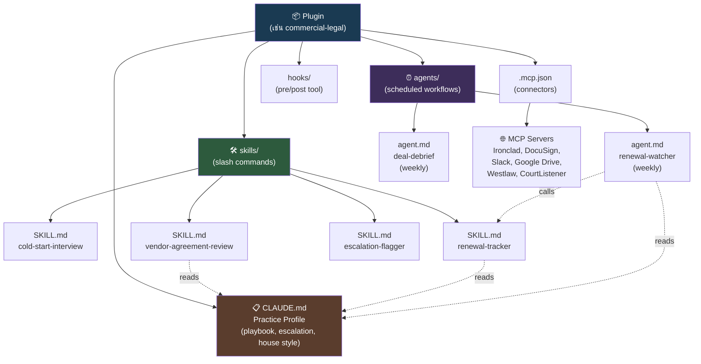
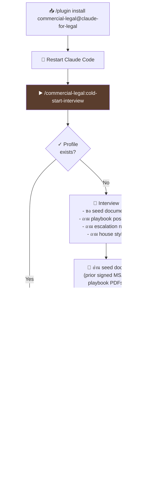
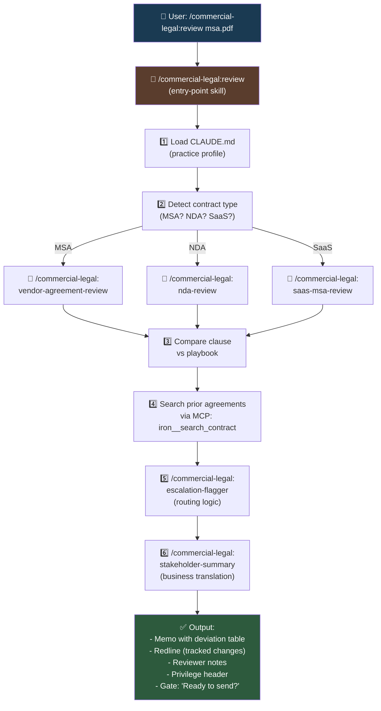
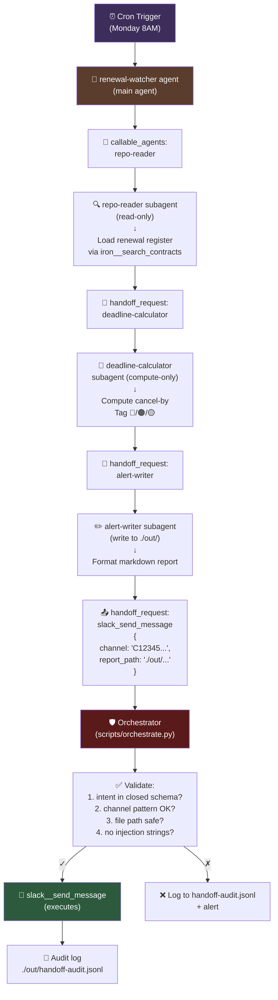
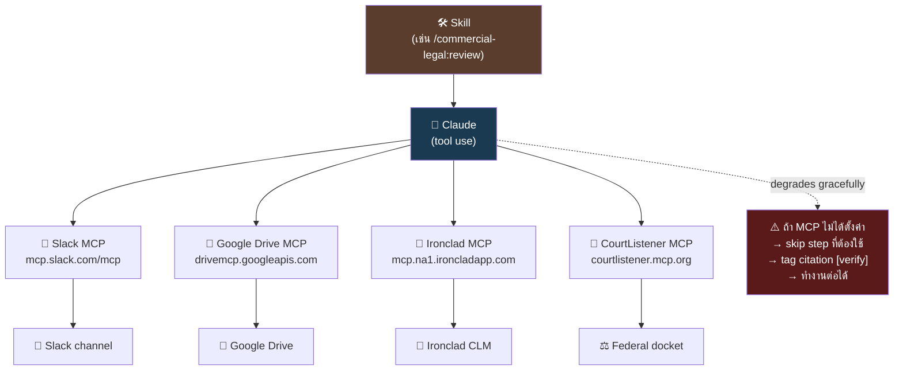

# สถาปัตยกรรมระบบ

> "Everything is markdown and JSON. No build step."
> — README, anthropics/claude-for-legal

หน้านี้อธิบายโครงสร้างภายในของ Claude for Legal — ตั้งแต่ระดับ macro (3 invocation surfaces) ไปจนถึงระดับ micro (skill เรียก skill อย่างไร) ผู้ที่ยังไม่ได้อ่าน [Claude for Legal คืออะไร](./what-is-it.html) ขอแนะนำให้อ่านก่อน เพราะหน้านี้ใช้ศัพท์เทคนิคจำนวนมาก

## ภาพใหญ่ — 3 Invocation Surfaces

Claude for Legal ออกแบบมาให้ skill และ agent ชุดเดียวกัน รันได้ใน **3 surface** ที่ต่างกัน — ผู้ใช้เลือกตามความเหมาะสมของ workflow



ทั้ง 3 surface ใช้ **system prompt ชุดเดียวกัน** และ **skill ชุดเดียวกัน** — ต่างกันแค่ที่รัน

| Surface | เหมาะกับ | invocation |
|---------|---------|-----------|
| **Cowork** | งาน interactive รายวัน, ทดลอง plugin ใหม่ | คลิก / พิมพ์ `/` ใน chat |
| **Claude Code** | งานที่ต้องการ MCP เยอะ, integration ลึก | ใน terminal พิมพ์ `/plugin install` แล้ว `/<plugin>:<skill>` |
| **Managed Agents** | งานหลังบ้านที่ run schedule (renewal-watcher, docket-watcher) | deploy ครั้งเดียวผ่าน `scripts/deploy-managed-agent.sh` |

## ระดับ Repository — โครงสร้าง Directory

```
claude-for-legal/
├── .claude-plugin/
│   └── marketplace.json              # catalog ของ plugin ทั้งหมด
│
├── commercial-legal/                 # plugin
├── corporate-legal/                  # plugin
├── privacy-legal/                    # plugin
├── product-legal/                    # plugin
├── employment-legal/                 # plugin
├── regulatory-legal/                 # plugin
├── ai-governance-legal/              # plugin
├── ip-legal/                         # plugin
├── litigation-legal/                 # plugin
├── legal-clinic/                     # plugin
├── law-student/                      # plugin
├── legal-builder-hub/                # plugin
│
├── external_plugins/
│   └── cocounsel-legal/              # partner plugin (Thomson Reuters)
│
├── managed-agent-cookbooks/          # template สำหรับ deploy ผ่าน API
│   ├── renewal-watcher/
│   ├── docket-watcher/
│   ├── reg-monitor/
│   ├── launch-radar/
│   └── diligence-grid/
│
├── scripts/
│   ├── deploy-managed-agent.sh       # script deploy agent
│   ├── orchestrate.py                # reference orchestrator
│   ├── validate.py                   # structural validator
│   └── lint-tool-scope.py            # security linter
│
├── references/                       # shared templates
│   ├── company-profile-template.md
│   └── dashboard.md
│
├── README.md
├── QUICKSTART.md
├── CONNECTORS.md
└── CONTRIBUTING.md
```

ขนาดรวมประมาณ 6.1 MB — ทุกอย่างเป็น markdown และ JSON ไม่มี binary, ไม่มี build artifact

## ระดับ Plugin — โครงสร้างภายในแต่ละตัว

ทุก plugin มี shape เดียวกัน — ออกแบบให้สามารถ install ได้แยกอิสระ

```
<plugin>/
├── .claude-plugin/
│   └── plugin.json                   # metadata (name, version, description)
│
├── .mcp.json                         # รายการ MCP server ของ plugin นี้
│
├── CLAUDE.md                         # template practice profile
│                                      # → จะถูก copy ไปที่
│                                      # ~/.claude/plugins/config/claude-for-legal/<plugin>/CLAUDE.md
│                                      # หลัง cold-start-interview
│
├── README.md                         # คู่มือผู้ใช้ของ plugin
│
├── skills/
│   ├── cold-start-interview/
│   │   └── SKILL.md                  # skill บังคับ — ต้องรันก่อน skill อื่น
│   ├── <skill-2>/
│   │   └── SKILL.md
│   ├── <skill-N>/
│   │   └── SKILL.md
│   └── references/                   # shared markdown ของ plugin
│
├── agents/                           # scheduled agent (ถ้ามี)
│   ├── <agent-1>.md
│   └── <agent-N>.md
│
├── hooks/
│   └── hooks.json                    # pre/post-tool hooks (optional)
│
└── logs/                             # diagnostic logs (gitignored)
```

### ความสัมพันธ์ระหว่างชั้น



**ข้อสังเกตสำคัญ**

1. **CLAUDE.md เป็น single source of truth ของ personalization** — ทุก skill อ่านก่อนเริ่มทำงาน
2. **Skill เรียก skill ภายใน plugin เดียวกัน** ได้ผ่าน slash syntax — เป็น fan-in pattern
3. **Agent เรียก skill** ได้เช่นกัน — agent คือ "skill runner" ตามตารางเวลา
4. **MCP เป็น layer ต่อสู่โลกภายนอก** — skill อ่าน/เขียนข้อมูลผ่าน MCP tool

## ระดับ Skill — โครงสร้างไฟล์ SKILL.md

ทุก skill เป็นไฟล์ markdown หนึ่งไฟล์ มี frontmatter (YAML) ที่ขึ้นต้นด้วย `---`

```markdown
---
name: vendor-agreement-review
description: >
  Review a vendor MSA against your sales-side or purchasing-side playbook
  and produce a redline memo with deviation analysis. Used when user
  uploads or references a vendor agreement.
argument-hint: "[file-path]"
user-invocable: true
---

# /commercial-legal:vendor-agreement-review

## Purpose
ทบทวน vendor MSA เทียบกับ playbook ที่บันทึกใน CLAUDE.md...

## Instructions

### Step 1: Load practice profile
- Read ~/.claude/plugins/config/claude-for-legal/commercial-legal/CLAUDE.md
- If profile missing or has [PLACEHOLDER] → stop, ask user to run cold-start

### Step 2: Determine contract type
...

### Step 3: Deviation analysis
- For each clause, compare against playbook position
- Tag each deviation: 🔴 / 🟡 / 🟢
- Cite playbook position
...

### Step N: Output
- Markdown memo with deviation table
- Redlines (tracked changes format)
- Gate: "Ready to send redlines?"
```

### Frontmatter field สำคัญ

| Field | ความหมาย |
|-------|---------|
| `name` | ชื่อ skill (kebab-case) — ใช้สร้าง slash command |
| `description` | ภายใต้ 1024 ตัวอักษร — **ใช้เป็น trigger signal** เมื่อ Claude ตัดสินใจว่าจะเรียก skill นี้อัตโนมัติหรือไม่ |
| `argument-hint` | ตัวอย่าง argument |
| `user-invocable` | `true` = ผู้ใช้เรียกได้, `false` = pure reference (เรียกจาก skill อื่นเท่านั้น) |

## Workflow Cold-Start — ขั้นตอนแรกที่ทุก plugin ใช้



**ความสำคัญของ cold-start**: ตามคำเตือนของ Anthropic — **"การข้าม setup คือสาเหตุที่พบบ่อยที่สุดที่ skill ให้ผลลัพธ์ทั่ว ๆ ไป"** (the single most common reason a skill produces generic output)

Interview ใช้เวลา 10–20 นาทีต่อ plugin มี quick-start mode สำหรับผู้ที่อยากเริ่มในไม่กี่นาทีและค่อย refine ภายหลัง

## Workflow Skill — Fan-in Pattern



## Workflow Scheduled Agent — Managed Agents Topology

สำหรับ agent ที่รันแบบ headless ผ่าน Managed Agents API ของ Anthropic



**หัวใจของ security model**

- **Main agent ไม่มี write permission** — ส่งได้แค่ `handoff_request` event
- **เฉพาะ leaf subagent ที่กำหนดเอง** จึงมีสิทธิ์เขียน
- **Orchestrator คือ firewall** — validate ทุก handoff ตาม closed schema ก่อนทำงาน
- **ทุก handoff ถูก audit** — log ลง `./out/handoff-audit.jsonl`

หลักการนี้คือ "**Orchestrator as Firewall**" ซึ่งจะอธิบายลึกในหมวด [หลักการออกแบบ](./principles.html)

## ระดับ Connector — MCP Architecture



### Citation Tagging — กลไกความน่าเชื่อถือ

| สถานะ | Tag | ความหมาย |
|------|-----|---------|
| Verified | `[CourtListener]`, `[Trellis]` | จาก research MCP — date-stamped, ตรวจสอบกับฐานข้อมูลที่ authoritative |
| Unverified | `[verify]` | จาก training data — ผู้ใช้ต้องตรวจ |
| No research tool | reviewer header | ระบุว่า "sources weren't verified" ไว้ด้านบนเอกสาร |

หลักการนี้คือ "**Citation Discipline**" ซึ่งอธิบายลึกในหมวด [หลักการออกแบบ](./principles.html)

## Stats สรุป

| มิติ | จำนวน |
|------|------|
| Core plugin | 12 |
| Partner plugin | 1 (CoCounsel Legal — Thomson Reuters) |
| Total skill | ~151 |
| Scheduled agent | ~10 |
| Managed-agent cookbook | 5 |
| MCP connector (configured by default) | 7–15 per plugin |
| Total lines of skill code | ~45,000–75,000 |
| Repository size | 6.1 MB |
| Build step | 0 |

## เอกสารถัดไป

- [หลักการออกแบบ](./principles.html) — Anthropic ฝังหลักการอะไรไว้ใน architecture นี้?
- [Quickstart — เริ่มต้นใช้งาน](./quickstart.html) — ลองรันจริง

← กลับไป [01 ภาพรวม](./)
