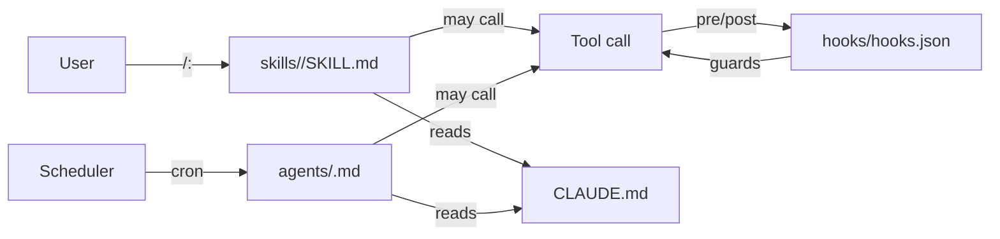

# โฟลเดอร์ `agents/` และ `hooks/` — งานเบื้องหลัง

> *"The docket moves whether or not you're watching it."*
> — `litigation-legal/agents/docket-watcher.md`

นอกจาก `skills/` ที่ user เรียก ยังมี **2 โฟลเดอร์** ภายใน plugin ที่ทำงาน **โดยที่ user ไม่ได้เรียก** — `agents/` กับ `hooks/` — บทบาทต่างกันแต่สำคัญทั้งคู่

## ภาพรวม

```text
<plugin>/
├── agents/                  ← scheduled / named worker
│   ├── renewal-watcher.md
│   ├── deal-debrief.md
│   └── playbook-monitor.md
└── hooks/
    └── hooks.json           ← pre/post tool gate
```

| ลักษณะ | `agents/` | `hooks/` |
|---|---|---|
| Trigger | schedule (weekly, daily) หรือ trigger phrase | ก่อน/หลัง tool call ทุกครั้ง |
| Format | `.md` (มี YAML frontmatter) | `.json` |
| Output | report / draft / alert | block / allow / modify tool call |
| ตัวอย่าง | `renewal-watcher.md`, `docket-watcher.md` | (default empty; เปิด guardrail พิเศษ) |

## โฟลเดอร์ `agents/` — scheduled / named worker

### Agent คืออะไร

Agent = **worker ที่ทำงานโดยไม่ต้องรอ user prompt** — ส่วนใหญ่:

- รัน weekly / daily ตาม schedule
- อ่าน external data source (MCP)
- โพสต์ output ไปยัง destination ที่กำหนด (Slack, email, file)
- ถ้ามีอะไรเร่งด่วน → escalate ทันที (ไม่รอ schedule)

### Agent file format

ตัวอย่างจาก `commercial-legal/agents/renewal-watcher.md`:

```markdown
---
name: renewal-watcher
description: >
  Scheduled agent that checks the renewal register and posts what's coming up.
  Runs weekly by default. Posts to the channel named in
  `~/.claude/plugins/config/claude-for-legal/commercial-legal/CLAUDE.md` →
  House style → Renewal alerts. Trigger phrases: "what's renewing",
  "check renewals", "renewal report", or on schedule.
model: sonnet
tools: ["Read", "Write", "mcp__ironclad__*", "mcp__*__slack_send_message"]
---

# Renewal Watcher Agent

## Purpose
...

## Schedule
Weekly, Monday morning. Configurable...

## What it does
1. Read CLAUDE.md to get alert destination
2. Load renewal-tracker skill, run Mode 2
3. If 🔴 items (0-13 days), post immediately
4. ...
```

### YAML frontmatter ของ agent

| ฟิลด์ | required | คำอธิบาย |
|---|---|---|
| `name` | yes | ชื่อ agent — ใช้สำหรับ trigger จาก phrase หรือ schedule |
| `description` | yes | รวม **schedule cadence** + **trigger phrases** + **destination** |
| `model` | optional | model ที่จะใช้ (เช่น `sonnet`, `opus`) |
| `tools` | yes | array ของ tool ที่ agent มีสิทธิ์ใช้ — รวม MCP wildcards |

### `tools` field — สำคัญมาก

ทุก agent ต้องระบุ tool ที่ใช้ได้ — Claude Code จะ enforce — agent ใช้ tool นอกรายการนี้ไม่ได้

ตัวอย่าง:

```yaml
tools: ["Read", "Write", "mcp__ironclad__*", "mcp__*__slack_send_message"]
```

แปลว่า agent นี้ใช้:

- `Read` — อ่าน file ใน user filesystem
- `Write` — เขียน file (สำหรับ log/report)
- `mcp__ironclad__*` — ทุก tool ของ MCP server ชื่อ `ironclad`
- `mcp__*__slack_send_message` — `slack_send_message` ของ MCP server ใดก็ได้

หลัก **least privilege** — ขอเฉพาะที่ใช้ — `scripts/lint-tool-scope.py` ตรวจให้

### ตัวอย่าง agent จาก litigation-legal

```yaml
---
name: docket-watcher
description: >
  Scheduled agent that watches court dockets for matters in the active
  portfolio. Pulls new filings, computes candidate deadlines, cross-references
  against each matter's history and deliverables, and writes a docket status
  report. Trigger: "watch the docket", "any new filings", "docket check",
  "what's due", or on schedule.
model: sonnet
tools: ["Read", "Write", "mcp__trellis__*", "mcp__courtlistener__*", "mcp__*__slack_send_message"]
---
```

สังเกต — ไม่มี `Bash` หรือ `Edit` — agent นี้แค่ "อ่าน docket → เขียน report" — ไม่ต้องการ shell access

### Agent ใน plugin ต่าง ๆ

| Plugin | Agents |
|---|---|
| `commercial-legal` | `renewal-watcher.md`, `deal-debrief.md`, `playbook-monitor.md` |
| `corporate-legal` | dataroom-watcher (etc.) |
| `employment-legal` | `leave-tracker.md` |
| `litigation-legal` | `docket-watcher.md` |
| `regulatory-legal` | reg-monitor (etc.) |
| `product-legal` | launch-radar (etc.) |
| `legal-builder-hub` | auto-updater (etc.) |
| `ip-legal` | portfolio-watcher (etc.) |

`privacy-legal`, `ai-governance-legal`, `law-student`, `legal-clinic` ไม่มี agents/ — งานของ plugin เหล่านี้เป็น interactive ล้วน

### Agent vs Managed Agent (CMA)

**ระวังสับสน**:

- **Plugin agent** (`<plugin>/agents/*.md`) — รันใน Claude Code; trigger ด้วย phrase หรือ user แม้ schedule ก็ต้อง user invoke
- **Managed Agent (CMA)** (`managed-agent-cookbooks/<slug>/`) — รันใน Anthropic Managed Agents API; schedule จริง

จาก `managed-agent-cookbooks/README.md`:

> *"Every agent in this repo ships two ways: as a Claude Code plugin you install today, and as a Claude Managed Agent template your platform team deploys behind your own workflow engine."*

`agents/` ในแต่ละ plugin จึงเป็น **"agent ในรูป plugin form"** — CMA cookbook คือ "agent เดียวกันใน Managed Agents form" — ดู [cookbooks-folder](cookbooks-folder.html)

### หมายเหตุ: scheduling ใน Claude Code

จาก `employment-legal/agents/leave-tracker.md`:

> *"Run weekly (set a Monday-morning reminder to invoke `/employment-legal:leave-tracker`). Automated scheduling requires a separate integration — Claude Code agents do not self-schedule."*

แปลว่า — Claude Code agent **ไม่ run เอง**; ต้องมี integration ภายนอก (cron, calendar reminder ฯลฯ) มาเรียก ในขณะที่ Managed Agents API run cron ได้จริง

## โฟลเดอร์ `hooks/` — pre/post tool guardrails

### Hook คืออะไร

Hook = **callback ที่ run อัตโนมัติ** ก่อน / หลัง tool call ทุกครั้ง:

- **pre-tool hook** — run **ก่อน** tool call; สามารถ block ได้ (เช่น "ห้ามเขียน `.env`")
- **post-tool hook** — run **หลัง** tool call; ใช้ log / notify / cleanup

ใน `claude-for-legal` ส่วนใหญ่ `hooks.json` เป็น **empty** เพราะ guardrail อยู่ใน `CLAUDE.md` กับ `SKILL.md` แล้ว

### Hook file format

```text
<plugin>/hooks/
└── hooks.json
```

ตัวอย่าง content (default — ทุก plugin):

```json
{
  "hooks": {}
}
```

ถ้า plugin ใดต้องการ enable hook จริง รูปแบบจะเป็น (sketch):

```json
{
  "hooks": {
    "pre-tool": [
      {
        "match": "Write",
        "command": "python validate-not-secret.py",
        "block-on-fail": true
      }
    ],
    "post-tool": [
      {
        "match": "mcp__*__send_*",
        "command": "python audit-log.py"
      }
    ]
  }
}
```

### ทำไมส่วนใหญ่ empty?

จาก `CONTRIBUTING.md`:

> *"`<plugin>/CLAUDE.md` — the shared guardrails and the practice profile."*

→ Anthropic เลือกใส่ guardrail ใน `CLAUDE.md` (instruction layer) แทน hook (execution layer) เพราะ:

| Layer | ข้อดี | ข้อเสีย |
|---|---|---|
| `CLAUDE.md` guardrail | flexible, อธิบายเป็น natural language ได้ | ขึ้นอยู่กับ model — อาจ miss |
| `hooks.json` | deterministic — block ได้แน่ | rigid, ปรับยาก |

Anthropic เลือก flexibility — แต่ hook structure **มีอยู่** ถ้าต้องการ defense-in-depth

### Hook ที่อาจเปิดใช้

ในระดับ skill / domain มี hint ว่ามี case ที่ควรใช้:

- **Privilege filter** — block การส่ง privileged content ออก channel public
- **Audit log** — ทุก `Write` / `mcp__*__send_*` → log
- **Cost guard** — block tool ที่ราคาแพง (เช่น expensive Westlaw query) โดยไม่มี confirmation

แต่ในปัจจุบัน `claude-for-legal` ใช้ `CLAUDE.md` ครอบคลุมเรื่องเหล่านี้แทน

## สรุป: agents vs hooks vs skills



| โฟลเดอร์ | เริ่มทำงานจาก | ใคร invoke |
|---|---|---|
| `skills/` | user request | user |
| `agents/` | schedule / trigger phrase | scheduler หรือ user |
| `hooks/` | tool call | runtime (อัตโนมัติ) |

## ตัวอย่างจริงครบสมบูรณ์

### Workflow: ผู้ใช้ติดต่อ NDA

1. **User** drag NDA file ลง Claude Code → พิมพ์ "review this NDA"
2. **Runtime** match → `commercial-legal/skills/nda-review/SKILL.md`
3. **Skill** อ่าน `CLAUDE.md` → ดู NDA playbook → triage GREEN/YELLOW/RED
4. **Tool call** → `Read` (อ่าน NDA)
5. **Hook (pre-tool)** → check `hooks.json` → ถ้าไม่มี rule → allow
6. **Tool call** → `Write` (เขียน triage memo)
7. **Hook (post-tool)** → log (ถ้ามี audit hook)
8. **Output** → triage memo ให้ user

### Workflow: weekly renewal check

1. **Scheduler** (cron / reminder) → invoke `/commercial-legal:renewal-watcher`
2. **Runtime** match → `commercial-legal/agents/renewal-watcher.md`
3. **Agent** อ่าน `CLAUDE.md` → ดู channel ที่ post
4. **Tool call** → `mcp__ironclad__list_renewals`
5. **Hook** (pre/post) → ตรวจสอบ
6. **Agent** filter เฉพาะ 0-13 days → 🔴
7. **Tool call** → `mcp__*__slack_send_message`
8. **Output** → post ใน Slack channel

## สรุป

โฟลเดอร์ `agents/` กับ `hooks/`:

- **agents/** = scheduled / named worker (markdown + YAML)
- **hooks/** = pre/post tool gate (JSON)
- ส่วนใหญ่ของ Claude for Legal ใช้ guardrail ผ่าน `CLAUDE.md` มากกว่า `hooks/` — เลือกความ flexible
- agent ทุกตัวมี `tools` field — enforce least-privilege
- Plugin agent ≠ Managed Agent (cookbook) — same logic, different runtime

หน้าถัดไป → [cookbooks-folder](cookbooks-folder.html) จะอธิบาย `managed-agent-cookbooks/` — เวอร์ชัน managed-agent ของ agents เหล่านี้
