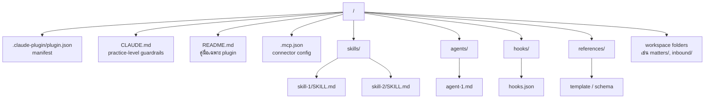

# Plugin anatomy — โครงสร้างภายในของ plugin

> *"`<plugin>/skills/<skill>/SKILL.md` — what this specific skill does, step by step. The narrow, task-specific scaffold.*
> *`<plugin>/CLAUDE.md` — the shared guardrails and the practice profile."*
> — `CONTRIBUTING.md`

หน้านี้อธิบาย **โครงสร้างมาตรฐาน** ของ plugin หนึ่งตัว — ทุก plugin ใน `claude-for-legal` (ยกเว้น external) ใช้ pattern นี้แบบเดียวกัน รู้แล้วจะอ่าน plugin ใดก็ได้

## ภาพรวมโครงสร้าง



## โครงสร้างจาก plugin จริง (`commercial-legal`)

```text
commercial-legal/
├── .claude-plugin/
│   └── plugin.json              # manifest — name, version, description, author
├── .gitignore
├── .mcp.json                    # MCP connector config (Ironclad, Slack ฯลฯ)
├── CLAUDE.md                    # 42.8 KB — guardrails + practice profile template
├── README.md                    # 8.4 KB — คู่มือเฉพาะ plugin
├── skills/                      # 14 skills
│   ├── nda-review/
│   │   └── SKILL.md
│   ├── vendor-agreement-review/
│   │   └── SKILL.md
│   ├── renewal-tracker/
│   │   ├── SKILL.md
│   │   └── references/          # static data ที่ skill อ่าน
│   ├── matter-workspace/
│   │   └── SKILL.md
│   └── ...
├── agents/                      # 3 scheduled agents
│   ├── deal-debrief.md
│   ├── playbook-monitor.md
│   └── renewal-watcher.md
├── hooks/
│   └── hooks.json               # pre/post tool gates (ส่วนใหญ่ empty)
└── logs/                        # runtime logs (gitignored)
```

## คำอธิบายแต่ละ subdirectory

| Path | บทบาท | ใครเขียน | Runtime เข้าถึง |
|---|---|---|---|
| `.claude-plugin/plugin.json` | **Manifest** — name, version, description, author | Author | อ่านเมื่อ load plugin |
| `CLAUDE.md` | **Guardrails + practice profile template** | Author + user (หลัง cold-start) | อ่านโดย skill ทุกครั้งที่ทำงาน |
| `README.md` | คู่มืออ่านโดยมนุษย์ | Author | ไม่ — มนุษย์อ่าน |
| `.mcp.json` | กำหนด MCP server ที่ plugin ใช้ | Author | อ่านเมื่อ load |
| `skills/<name>/SKILL.md` | **คำสั่งที่ user เรียก** — `/<plugin>:<skill>` | Author | อ่านเมื่อ skill ถูกเรียก |
| `skills/<name>/references/` | static data (checklist, schema, template) | Author | อ่านโดย SKILL.md เอง |
| `agents/<name>.md` | **scheduled / named worker** ไม่ใช่ user-invocable | Author | อ่านเมื่อ agent run |
| `hooks/hooks.json` | **pre/post tool gates** ที่ run โดยอัตโนมัติ | Author | อ่านทุก tool call |
| `references/` (ระดับ plugin) | template ใช้ข้าม skill | Author | skill อ่านเอง |
| `logs/` | runtime output | Plugin runtime | gitignored |

## `.claude-plugin/plugin.json` — manifest

ตัวอย่างจาก `commercial-legal/.claude-plugin/plugin.json`:

```json
{
  "name": "commercial-legal",
  "version": "1.0.2",
  "description": "Reviews vendor agreements, NDAs, and SaaS subscriptions against your sales-side or purchasing-side playbook, tracks renewals and cancel-by deadlines before they're missed, routes escalations to the right approver, and translates reviews into summaries business stakeholders will actually read.",
  "author": {
    "name": "Anthropic"
  }
}
```

| ฟิลด์ | required | คำอธิบาย |
|---|---|---|
| `name` | yes | ต้องตรงกับ `marketplace.json` → `plugins[i].name` |
| `version` | yes | SemVer — ใช้สำหรับ auto-update |
| `description` | yes | ประโยคทำงาน — verb-led, ไม่ใช่ noun phrase |
| `author.name` | yes | ผู้เขียน plugin (อาจต่างจาก marketplace owner) |

## `CLAUDE.md` — practice-level guardrails

หัวใจของทุก plugin **ไฟล์เดียวที่ skill ทุกตัวอ่าน** — เก็บ:

1. **Shared guardrails** ที่ใช้กับทุก skill ใน plugin นี้ เช่น:
   - "Source-tag discipline" — ทุก citation ต้องบอกที่มา
   - "Verify user-stated legal facts" — user บอก "in California" → ต้องเช็ค
   - "Destination check" — ก่อนเขียน privileged document ถามว่าจะส่งไปไหน
   - "Cross-skill severity floor" — ถ้า skill หนึ่งบอก HIGH risk skill อื่นต้องไม่ลดเป็น LOW
   - "Pre-flight citation banner" — บอก user ว่าจะ cite จากแหล่งใด

2. **Practice profile** ที่ user กรอกผ่าน `cold-start-interview`:
   - ที่ทำงาน (in-house / firm / clinic)
   - jurisdiction หลัก
   - playbook (NDA position, deal threshold ฯลฯ)
   - house style (font, tone, signature)
   - destination (Slack channel สำหรับ renewal alert ฯลฯ)

หลังจาก cold-start, runtime จะคัดลอก `CLAUDE.md` ไปยัง:

```text
~/.claude/plugins/config/claude-for-legal/<plugin>/CLAUDE.md
```

นี่คือ **user-specific copy** ที่ user แก้ได้ — repo's `CLAUDE.md` เป็น template เท่านั้น

## `.mcp.json` — connector config

ตัวอย่างจาก `commercial-legal/.mcp.json` (sketch):

```json
{
  "mcpServers": {
    "ironclad": {
      "command": "...",
      "auth": "oauth",
      "tools": ["search_contracts", "list_renewals"]
    },
    "slack": { ... }
  }
}
```

เมื่อ plugin install → Claude Code จะ prompt user authorize MCP server แต่ละตัว → จากนั้น skill เรียกใช้ `mcp__ironclad__search_contracts` ได้

ทุก plugin ที่ใช้ external data (Ironclad CLM, CourtListener, etc.) จะมี `.mcp.json` ของตัวเอง

## `README.md` — เอกสารเฉพาะ plugin

ไม่ใช่ runtime artifact — **มนุษย์อ่าน** เพื่อรู้ว่า plugin นี้:

- ใช้ทำอะไรบ้าง (list ทุก skill)
- ติดตั้งและ setup อย่างไร (cold-start)
- มี playbook structure อย่างไร
- เมื่อทำไม่ได้ จะ fallback อะไร
- known limitations

## `skills/` — โฟลเดอร์ skill ทั้งหมด

ดูรายละเอียดในหน้า [skills-folder](skills-folder.html) — มี SKILL.md format, YAML frontmatter, subfolder structure

จุดที่ต้องรู้ตอนนี้: **ทุก skill = หนึ่ง subdirectory** ภายใต้ `skills/` ชื่อ folder = ชื่อคำสั่ง (จะ invoke ผ่าน `/<plugin>:<skill-name>`)

## `agents/` — โฟลเดอร์ scheduled / named agents

ดูรายละเอียดในหน้า [agents-and-hooks](agents-and-hooks.html)

ไม่ใช่ทุก plugin ที่มี — เฉพาะ plugin ที่ต้องการ scheduled worker:

| Plugin | มี agents/? | ตัวอย่าง |
|---|---|---|
| `commercial-legal` | ✓ | `renewal-watcher.md`, `deal-debrief.md` |
| `corporate-legal` | ✓ | `dataroom-watcher.md` |
| `employment-legal` | ✓ | `leave-tracker.md` |
| `litigation-legal` | ✓ | `docket-watcher.md` |
| `regulatory-legal` | ✓ | `reg-monitor.md` |
| `legal-builder-hub` | ✓ | (auto-updater agents) |
| `product-legal` | ✓ | `launch-radar.md` |
| `ip-legal` | ✓ | `portfolio-watcher.md` |
| `ai-governance-legal` | ✗ | (ใช้ skill อย่างเดียว) |
| `privacy-legal` | ✗ | (ใช้ skill อย่างเดียว) |
| `law-student` | ✗ | (เน้น interactive drill) |
| `legal-clinic` | ✗ | (เน้น manual workflow) |

## `hooks/` — pre/post tool guardrails

มีทุก plugin (default = empty `{"hooks": {}}`) แต่บางตัวจะ enable hook เฉพาะเมื่อจำเป็น — ดูรายละเอียดในหน้า [agents-and-hooks](agents-and-hooks.html)

## `references/` — static data

template, checklist, schema ที่ skill อ่าน — ไม่ใช่ instruction (SKILL.md คือ instruction)

ตัวอย่างจริง:

```text
legal-clinic/references/
├── plausibility-bands/             # ตัวเลขสำหรับ deadline plausibility
└── (อื่น ๆ)

product-legal/references/
└── (risk calibration template)

commercial-legal/skills/renewal-tracker/references/
└── (renewal date format spec)
```

**กฎ**: ถ้าเป็น "ข้อมูลที่ skill ดึงไปใช้" → `references/`; ถ้าเป็น "ขั้นตอนที่ skill ทำ" → ต้องอยู่ใน `SKILL.md` (เพราะ `CONTRIBUTING.md` บอกว่า "SKILL.md encodes the right behavior")

## `logs/` — runtime output

ถ้า plugin เขียน log ระหว่าง run → ไปอยู่ที่นี่ และ gitignored — เพราะ:

- log มี user data sensitive
- มันคือ runtime artifact ไม่ใช่ source code

ไม่ใช่ทุก plugin มี — เฉพาะตัวที่ต้อง audit log (เช่น `commercial-legal/logs/`, `ip-legal/logs/`)

## Workspace folders — เฉพาะบาง plugin

บาง plugin มีโฟลเดอร์พิเศษนอกเหนือจาก standard structure:

```text
litigation-legal/
├── matters/                    ← portfolio of legal matters
├── inbound/                    ← incoming demand letters
├── demand-letters/             ← outbound demand letters
└── oc-status/                  ← weekly OC status drafts

legal-clinic/
├── client-comms/               ← per-case communication logs
└── handoffs/                   ← semester-end case handoffs

employment-legal/
└── data/                       ← (placeholder for runtime data)
```

โฟลเดอร์เหล่านี้ไม่ใช่ standard ของ Claude Code — เป็น **convention เฉพาะ plugin** — ดูรายละเอียดในหน้า [special-folders](special-folders.html)

## ตารางสรุประดับโฟลเดอร์ vs ระดับไฟล์

| ระดับ | ตัวอย่าง | บทบาท |
|---|---|---|
| **Plugin manifest** | `.claude-plugin/plugin.json` | บอก runtime ว่า plugin คืออะไร |
| **Plugin guardrails** | `CLAUDE.md` | safety net ที่ skill ทุกตัวพึ่ง |
| **User-facing docs** | `README.md` | คู่มือสำหรับมนุษย์ |
| **Connector config** | `.mcp.json` | external server ที่ plugin ใช้ |
| **User-invocable commands** | `skills/<name>/SKILL.md` | คำสั่งที่ user เรียก |
| **Background workers** | `agents/<name>.md` | scheduled agents |
| **Auto-fired gates** | `hooks/hooks.json` | pre/post tool guard |
| **Static data** | `references/`, `skills/*/references/` | template, checklist |
| **Workspace** | `matters/`, `inbound/`, etc. | per-plugin convention |
| **Runtime** | `logs/` | gitignored output |

## เกณฑ์การออกแบบ (จาก CONTRIBUTING.md)

> *"If a QA test passes only because a guardrail fired, add the behavior to the SKILL.md directly. The guardrail stays (belt and suspenders), but the skill now carries the knowledge it needs on its own."*

แปลว่า:

1. **SKILL.md = primary instruction** — ใส่ logic ไว้ที่นี่
2. **CLAUDE.md = safety net** — catch สิ่งที่ SKILL.md พลาด (belt + suspenders)
3. **อย่าพึ่ง CLAUDE.md** — ถ้า skill ต้องการ guard เฉพาะ ใส่ใน SKILL.md เลย

## สรุป

Plugin ของ `claude-for-legal` มีโครงสร้าง:

- **Manifest** (`.claude-plugin/plugin.json`) → ระบุตัวตน
- **Practice-level CLAUDE.md** → guardrails + profile
- **`skills/`** → คำสั่งที่ user เรียก (น้อยสุด 1; มากสุด ~20 ตัว)
- **`agents/`** (optional) → scheduled worker
- **`hooks/`** → pre/post tool gate
- **`references/`** → static data
- **Workspace folders** (optional) → convention เฉพาะ plugin
- **`.mcp.json`** → external connector

หน้าถัดไป → [skills-folder](skills-folder.html) จะลงลึกที่ `skills/` — รวมถึง `SKILL.md` format ที่เป็นหัวใจของทุก plugin
